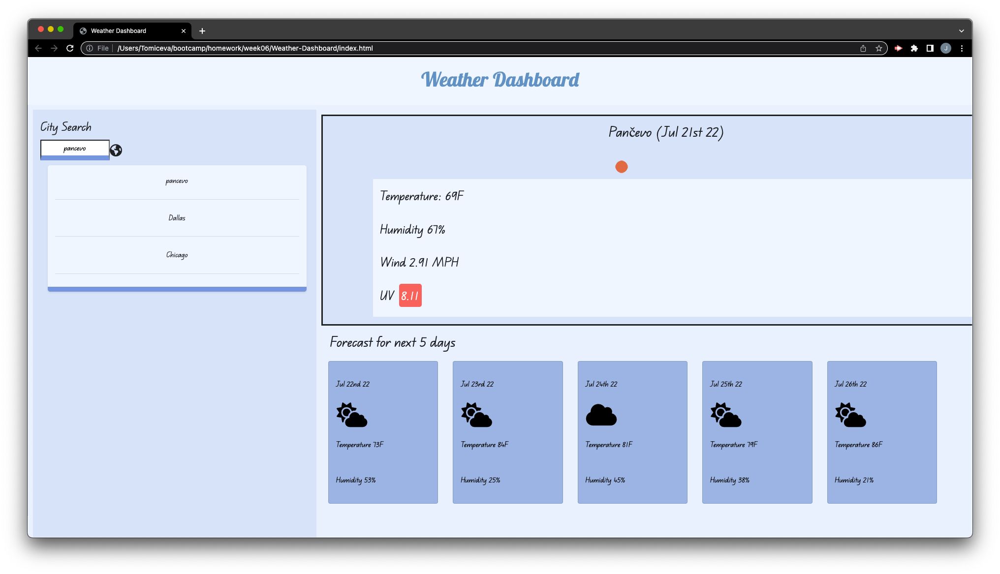

# Weather-Dashboard

 
 ## Deployed application
 https://jelenatomic.github.io/Weather-Dashboard/

## Description 
We had to make weather app that show current temperature, humidity, wind and uv of the city along with forecast for next 5 days. 
We also had to show our knowledge using API.

## Installation
From Git Hub repository, first-portfolio, click CODE box, select SSH and copy the repository to your clipboard.  In your command-line navigate to the folder you want to hold the repository. 
  

## Usage
When you open the page you will be present with search bar where you can type desire city you wish to lookup

When you type in desire city the current weather with the icon will be presented to you in the main box, along with forecast with the icons of the weather for the following 5 days.

When you type new city, previous city will appear in the list below and you will be present with the weather for new city.

If user decide to go back from the chosen list and click on the city from the history, weather for the city will be presented on the screen

## Credits
https://fontawesome.com/icons/floppy-disk?s=duotone
 
https://bootstrapcreative.com/resources/bootstrap-4-css-classes-index/
 
https://momentjs.com/
 
https://developer.mozilla.org/en-US/docs/Web/JavaScript/Reference/Global_Objects/Date/getDate
 
https://fonts.google.com/specimen/Edu+QLD+Beginner
 
https://jqueryui.com/draggable/
  
https://www.youtube.com/watch?v=n4dtwWgRueI
 
Google
 
askBCS
